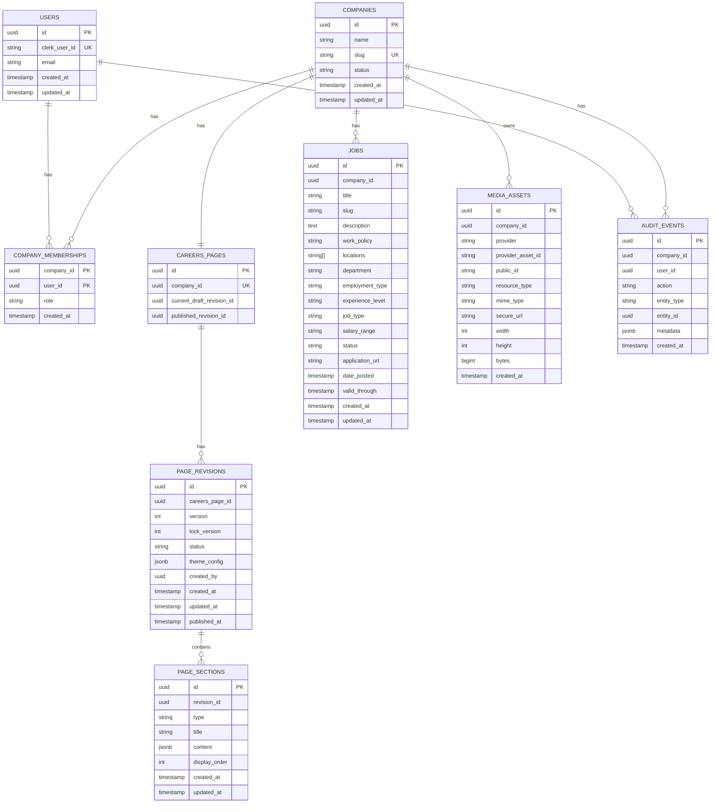

# Tech Spec

## 1. Assumptions

The assignment leaves some implementation details open, so I made the following assumptions:

- Whitecarrot is mainly used by recruiters.
- A company can have one Careers Page.
- A recruiter can only manage companies they are a member of.
- Candidates do not need a Whitecarrot account.
- Candidates apply through an external application URL.
- Jobs are associated with a company.
- Recruiters can save changes as a draft before publishing them.
- Careers Page themes are separate from the Whitecarrot application theme.
- A small number of predefined themes are provided instead of allowing completely free-form page design.
- The provided sample job data with some modification is used as seed data.

---

## 2. Tech Stack

| Area            | Technology             |
| --------------- | ---------------------- |
| Framework       | Next.js                |
| Language        | TypeScript             |
| UI              | React                  |
| Styling         | Tailwind CSS           |
| Components      | shadcn/ui and 21st.dev |
| Database        | Neon PostgreSQL        |
| ORM             | Drizzle ORM            |
| Authentication  | Clerk                  |
| Forms           | React Hook Form        |
| Drag and Drop   | dnd-kit                |
| Media Storage   | Cloudinary             |
| Hosting         | Vercel                 |
| Package Manager | pnpm                   |

I chose Next.js because the application needs both authenticated recruiter pages and public, SEO-friendly Careers Pages.

PostgreSQL is used because most of the application's data has clear relationships between companies, recruiters, pages, sections and jobs.

---

## 6. Architecture

The application is built as a single Next.js application.

```text
                         ┌───────────────────┐
                         │      Recruiter    │
                         └─────────┬─────────┘
                                   │
                                   ▼
                         ┌───────────────────┐
                         │    Next.js App    │
                         └───────┬─────┬─────┘
                                 │     │
                    ┌────────────┘     └────────────┐
                    ▼                               ▼
          ┌──────────────────┐             ┌─────────────────┐
          │ Neon PostgreSQL  │             │   Cloudinary    │
          └──────────────────┘             └─────────────────┘
                    ▲
                    │
          ┌─────────┴─────────┐
          │       Clerk       │
          │  Authentication   │
          └───────────────────┘
```

The application is kept as one codebase because the current product is not large enough to need separate services.

If the product grows later, individual parts can be separated when there is a real need for it.

---

## 7. Database Schema

The main database entities are:

- Users
- Companies
- Company Memberships
- Careers Pages
- Page Revisions
- Page Sections
- Jobs
- Media Assets
- Audit Events

### Entity Relationship



---

## 8. Main Tables

### Users

The `users` table stores the application-level user.

Clerk is responsible for authentication. The application stores the Clerk user ID so that the authenticated Clerk user can be connected to the application data.

---

### Companies

A company represents a customer using Whitecarrot.

Important fields include:

- `name`
- `slug`
- `status`

The slug is unique because it is used in the public Careers Page URL.

---

### Company Memberships

A recruiter gets access to a company through this table.

A membership contains:

- Company
- User
- Role

Roles are:

- Owner
- Admin
- Editor

This also allows the same recruiter account to be associated with more than one company in the future.

---

### Careers Pages

Each company has one Careers Page.

The table also keeps references to:

- Current draft revision
- Published revision

This makes it possible to edit a draft without changing what candidates currently see.

---

### Page Revisions

A revision represents a version of the Careers Page.

A revision contains:

- Version number
- Status
- Theme configuration
- Creator
- Creation/update timestamps
- Published timestamp

Revision statuses are:

- `draft`
- `published`
- `archived`

The `lock_version` field is used to help detect conflicting updates.

---

### Page Sections

Sections contain the actual page content.

Supported section types include:

- About
- Life at Company
- Jobs
- Our Values
- Where We Work
- Perks
- Custom Text

Each section has a `display_order`, which determines where it appears on the page.

The section content is stored as JSON because different section types need different content.

The section type still controls what structure is allowed inside the JSON.

---

### Jobs

Jobs belong directly to a company.

Important fields include:

- Title
- Slug
- Description
- Locations
- Department
- Employment type
- Experience level
- Job type
- Salary range
- Status
- Application URL
- Date posted
- Valid through

The combination of company and job slug is unique.

This allows different companies to have jobs with the same slug without causing conflicts.

---

### Media Assets

Media files are stored using Cloudinary.

The database stores the information needed to reference the uploaded asset.

This includes:

- Cloudinary asset ID
- Public ID
- URL
- File type
- Dimensions
- File size

The actual media file does not need to be stored in PostgreSQL.

---

### Audit Events

Important actions can be recorded in the audit table.

This gives the application a basic history of important changes and also makes it easier to investigate issues later.

---
