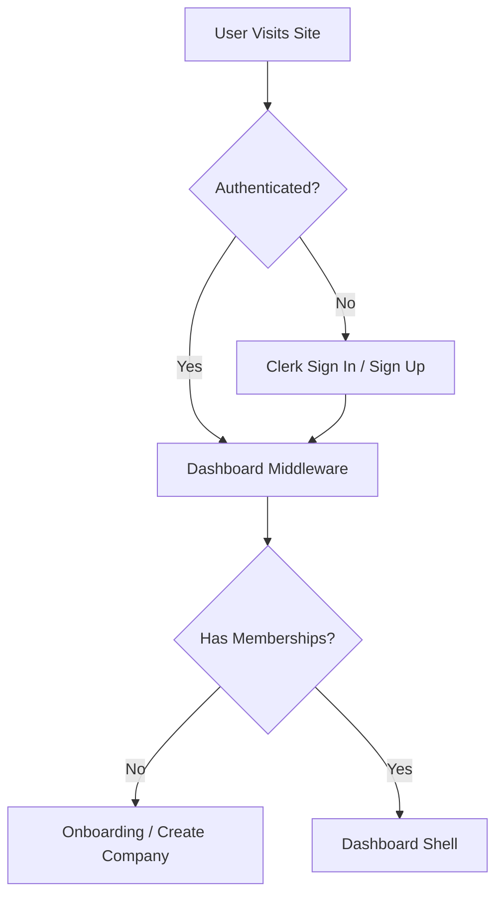

# Phase 4 — User Onboarding & Functional Application Shell

## Overview
This phase introduces a seamless user onboarding flow for newly authenticated users, ensuring they can easily create a company (tenant) without requiring manual database intervention. It also establishes a functional application shell representing the core recruiter dashboard.

## Architecture & Lifecycle

### Authentication & Authorization Flow

### 1. New User
When a new user signs up via Clerk:
1. They authenticate successfully.
2. They are redirected to `/dashboard`.
3. The dashboard attempts to retrieve their `company_memberships`. Since they have none, they are safely redirected to `/onboarding`.

### 2. Company Creation (Onboarding)
In the `/onboarding` route:
1. The user inputs their desired Company Name and Slug.
2. A Next.js Server Action initiates a strict PostgreSQL transaction to:
   - Insert the new `company`.
   - Initialize a new `careers_pages` record along with a `page_revisions` draft.
   - Insert a `company_memberships` record assigning the new user the `owner` role.
3. Upon success, they are redirected back to `/dashboard`.

### 3. Existing User
When an existing user with memberships signs in, they land securely on the `/dashboard` shell.
- They see a list of their affiliated companies.
- They can navigate to `/[company-slug]/edit` to manage the careers page, relying entirely on the server-side role validations implemented in Phase 3.

## Decisions
- **Company Membership Model**: Retained the existing `users -> company_memberships -> companies` multi-tenant architecture. 
- **Initial Role**: A user creating a company is always assigned the `owner` role.
- **Invitation Behavior**: Complex multi-user invitations are deferred to a later phase to focus exclusively on establishing the core onboarding foundation.
- **Multiple Memberships**: If a user is added to multiple companies in the future, `/dashboard` automatically lists all of them, providing discrete entry points into each tenant's context.

## Security Boundaries
- **Authentication**: Checked early via Clerk Middleware (`src/proxy.ts`).
- **Authorization**: Checked deeply via `requireCompanyRole()`. Tenant contexts are derived safely from the URL slug and crossed-checked against the database's `company_memberships` table.
- **Client vs Server**: All onboarding validations (like slug uniqueness) and tenant assignments happen securely inside a server-side transaction.

## Manual Verification
The following manual QA flows have been successfully verified locally:
- [x] **New User**: Signing up correctly forces an onboarding redirect. Creating a company successfully routes them to their dashboard.
- [x] **Existing Member**: Repeated sign-ins route straight to the dashboard.
- [x] **Unauthorized Access**: User A attempting to access Company B’s edit route correctly returns a 403 Forbidden.
- [x] **Tenant Spoofing**: Manually changing the URL slug does not bypass the strict role/membership checks.
- [x] **Logout/Login**: Protected routes remain inaccessible after logout.

## Known Limitations
- Joining an existing company via email invites/links is deferred.
- The UI is currently a functional shell and deliberately lacks extensive visual polish or drag-and-drop features (reserved for later phases).
